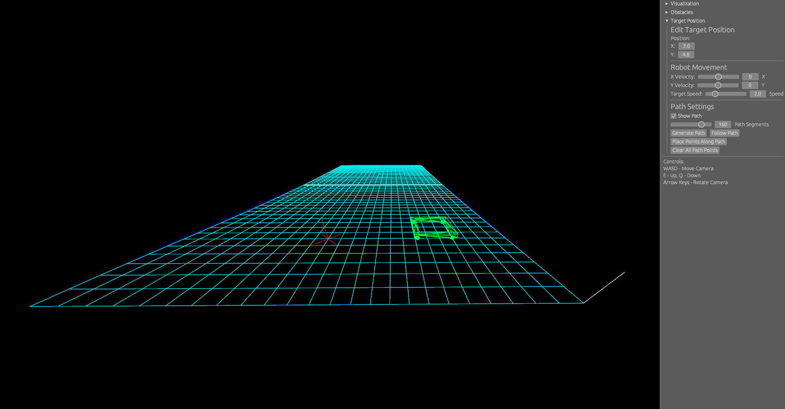
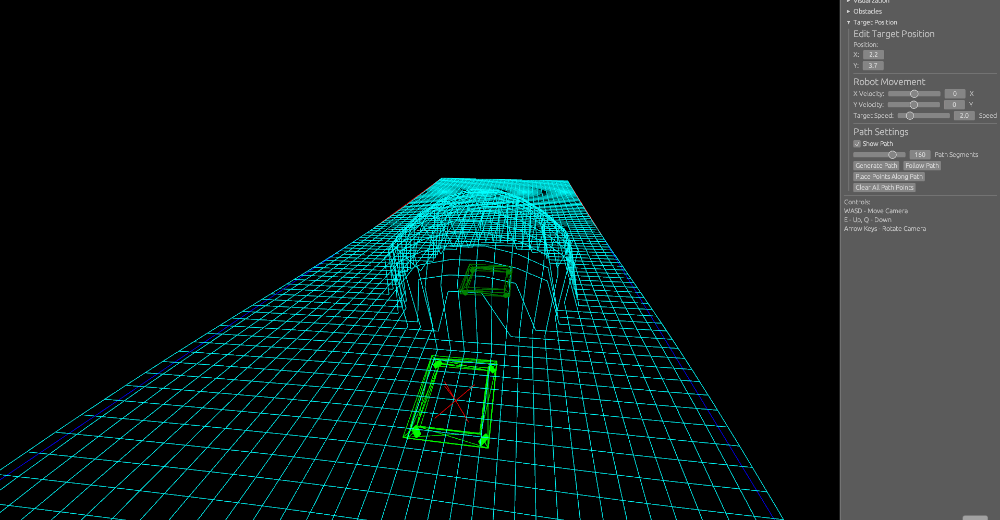
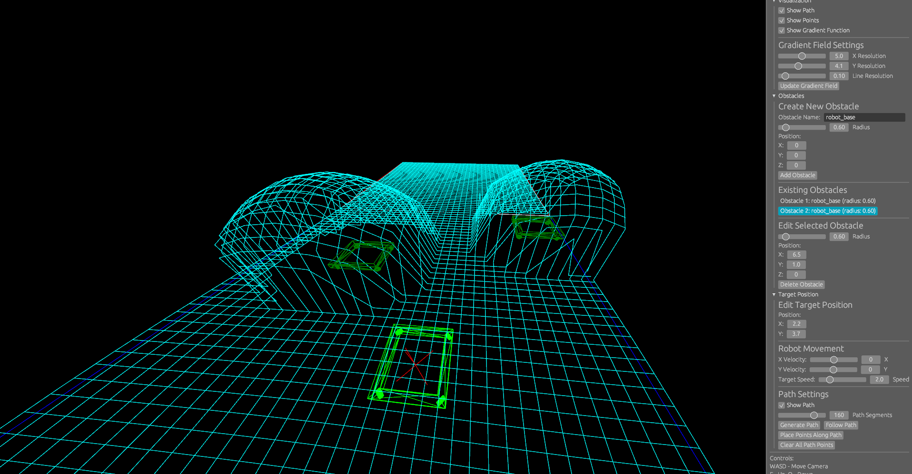
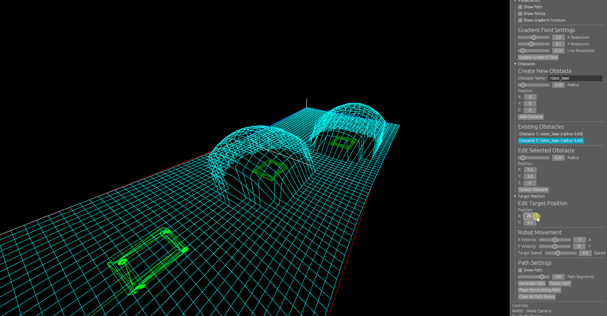

# Robot Object‑Avoidant Path Generation Visualizer

Simulation for FIRST robotics on collision avoidant autonomous path generation around dynamic obstacles.

## What This Is
- A simulation: a virtual environment to experiment with collision avoidant path planning.
- Uses a field‑based approach: obstacles create repulsive fields that allow the path to be optimized by following the negative gradient away from obstacles.
- Built with `nannou` for rendering and `nannou_egui` for interactive controls.
- loads simple 3D shapes from `models/*.stl` to draw obstacles and markers.
- Intended for robotics path planning experiments, such as FIRST Robotics autonomous routines.

## How It Works
- Field and models: The app draws a rectangular field and renders STL models (robot base, cubes, etc.) as wireframes for visibility.
- Obstacles: Each obstacle contributes to a scalar “height” field in the plane. The total field is the sum of all obstacle fields.
- Path generation: A straight, segmented path is seeded between the robot’s start and the target. Each intermediate point gets a height based on nearby obstacles.
- Path optimization: Iteratively adjusts path points by moving them along the negative gradient of the obstacle field and enforcing a minimum obstacle clearance. The process stops when all points are “low enough” and safely distant, or when max iterations are reached.
- Visualization: You can toggle a gradient field overlay, see the generated path, place points along the path, and tune parameters (segments, speeds, resolutions).

### Path Generation Math

This project uses transformed piecewise cosine field functions and gradient decent optimization to shape a collision avoidant path.

- Obstacle field (transformed piecewise cosine): for obstacle $i$ with center $c_{i}$ and clearance radius $R_{\mathrm{calc}, i}$

$$
V_{i}(r) =
\begin{cases}
  \dfrac{b_{i}}{2}\cos\left(\dfrac{\pi r}{b_{i}}\right), & 0 \le r \le R_{\mathrm{calc}, i} \\
  0, & r > R_{\mathrm{calc}, i}
\end{cases}
\quad \text{with } b_{i} = \pi R_{\mathrm{calc}, i}
$$

  where $r = \|p - c_{i}\|$ and $R_{\mathrm{calc}, i} = r_{\mathrm{obstacle}} + r_{\mathrm{robot}} + r_{\mathrm{buffer}}$ scales the transform so the field vanishes at the clearance boundary.

- Gradient (repulsive direction): letting $\mathbf{e}_{r} = (p - c_{i})/r$ be the radial unit vector,

$$
\nabla V_{i}(p) = -\frac{\pi}{2}\sin\left(\frac{\pi r}{b_{i}}\right)* \mathbf{e}_{r}
$$

  In code, this is scaled by an adjustment rate and applied so that points move away from obstacles when accumulating gradients across all obstacles.

- Total field and descent step:

$$
V_{\mathrm{total}}(p) = \sum_{i} V_{i}(p) \qquad
\nabla V_{\mathrm{total}}(p) = \sum_{i} \nabla V_{i}(p)
$$

  and path points are updated by a repulsive step akin to

$$
p \leftarrow p - \alpha\* \nabla V_{\mathrm{total}}(p)
$$

  with additional clearance enforcement when $r < R_{\mathrm{calc}, i}$.

- Convergence criteria: the optimizer stops when point heights fall below a threshold and all points maintain a minimum safe distance from every obstacle, or after a maximum iteration cap.

## Path Following Math
The followed path is a uniform Catmull–Rom spline through the optimized path points.

- Spline point for four consecutive points $p_0, p_1, p_2, p_3$ with local parameter $t \in [0,1]$:

$$
\mathbf{C}(t) = \tfrac{1}{2}\Big[(-t^3 + 2t^2 - t)\*\mathbf{p}_{0} + (3t^3 - 5t^2 + 2)\*\mathbf{p}_{1} + (-3t^3 + 4t^2 + t)\*\mathbf{p}_{2} + (t^3 - t^2)\*\mathbf{p}_{3}\Big]
$$

- Tangent (derivative) of the spline:

$$
\mathbf{C}'(t) = \tfrac{1}{2}\Big[(-3t^2 + 4t - 1)\*\mathbf{p}_{0} + (9t^2 - 10t)\*\mathbf{p}_{1} + (-9t^2 + 8t + 1)\*\mathbf{p}_{2} + (3t^2 - 2t)\*\mathbf{p}_{3}\Big]
$$

- Global progress to segment mapping. With $N$ control points, there are $M = N - 3$ spline segments. For global progress $\tilde t \in [0,1]$:

$$
\text{segment } k = \big\lfloor \tilde t\* M \big\rfloor, \quad t = \tilde t\* M - k, \quad (\mathbf{p}_{0},\mathbf{p}_{1},\mathbf{p}_{2},\mathbf{p}_{3}) = (\mathbf{P}_{k}, \mathbf{P}_{k+1}, \mathbf{P}_{k+2}, \mathbf{P}_{k+3})
$$

- Velocity (continuous formulation) with target speed $v_{\text{target}}$:

$$
\mathbf{v}(\tilde t) = v_{\mathrm{target}}\* \dfrac{\mathbf{C}'(t)}{\lVert \mathbf{C}'(t) \rVert}
$$

- Implementation detail (finite-difference arc-length step): choose a small $\Delta \tilde t$ so the chord length matches $d = v_{\text{target}}\* \Delta t$:

$$
\Delta \tilde t \text{ s.t. } \big\lVert \mathbf{C}(t + \Delta \tilde t) - \mathbf{C}(t) \big\rVert \approx v_{\mathrm{target}}\* \Delta t, \quad
\mathbf{v} \approx v_{\mathrm{target}}\* \dfrac{\mathbf{C}(t + \Delta \tilde t) - \mathbf{C}(t)}{\big\lVert \mathbf{C}(t + \Delta \tilde t) - \mathbf{C}(t) \big\rVert}
$$

- Next position update over time step $\Delta t$:

$$
\mathbf{p}_{\mathrm{next}} = \mathbf{p}_{\mathrm{current}} + \mathbf{v}\* \Delta t
$$

This effectively implements the process of advancing global progress by $\Delta \tilde t$, normalizing the chord direction, scaling by $v_{\text{target}}$, and integrating position with Euler stepping.

## Controls and UI
In the right panel:
- Toggle `Show Gradient Function` and adjust `X Resolution`, `Y Resolution`, and `Line Resolution`.
- Click `Update Gradient Field` to refresh the overlay.
- Under `Obstacles`:
  - `Create New Obstacle` inputs for name, scale, and position.
  - `Add Obstacle` to place it on the field.
  - Manage existing obstacles: select, move, change radius, `Delete Obstacle`.
- Under `Target Position`:
  - Drag `X` and `Y` to move the goal, auto regenerating and re‑optimizing the path.
  - `Robot Movement`: sliders for `X Velocity`, `Y Velocity`, and `Target Speed`.
- Under `Path Settings`:
  - Toggle `Show Path`.
  - Adjust `Path Segments`.
  - Buttons: `Generate Path`, `Follow Path`, `Place Points Along Path`, `Clear All Path Points`.

## Screenshots / Images

### Simulation Enviornment

### Obstacle Calculation

### Obstacle Interaction

### Path Recalculation

### Path Following

## Project Structure
- `src/main.rs` — app entry and UI, rendering and interaction.
- `src/robot.rs` — robot model, path generation, optimization, path following.
- `src/obstacle.rs` — obstacle model with cosine and gaussian field functions and gradients.
- `src/gradient_field.rs` — builds gradient wire overlays from the field function.
- `src/model.rs`, `src/wire.rs`, `src/position.rs`, `src/field.rs`, `src/target_position.rs` — supporting types for geometry, drawing, and state.
- `models/` — STL models used for wireframe visualization.

## Notes
- The cosine field is the default for optimization, but gaussian field utilities exist and can be experimented with.
- Path optimization caps at a max iteration count to avoid infinite loops.
- thresholds and rates are configurable in code.
